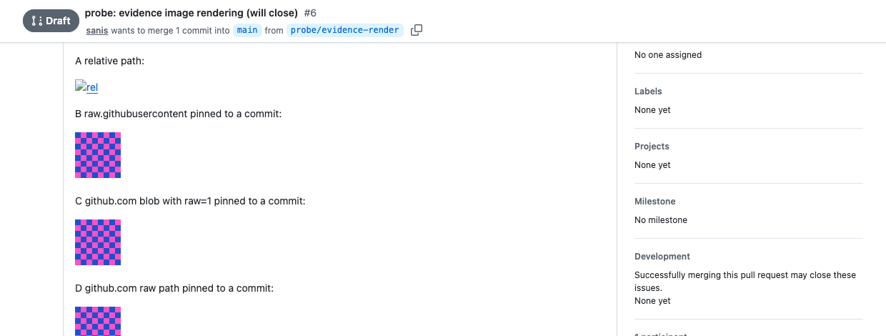

# Evidence artifact upload verification

Audience: maintainer verification.

This record supports the per-surface upload mechanics in [`.agents/skills/evidence-artifacts/SKILL.md`](../../.agents/skills/evidence-artifacts/SKILL.md).
That skill states the operating contract; this record holds the dated evidence for the vendor behavior it depends on.
Re-run these checks when a forge or connector surface changes, and update the skill only from a refreshed result.

## GitHub pull request image embedding

Verified on 2026-08-09 against GitHub.com, using a throwaway pull request whose body embedded the same 64x64 PNG through four candidate URL forms.

Rendering was read from the live pull request page rather than from the `/markdown` API, because that API returns an unresolved render: it leaves a relative path relative and applies none of the issue-context rewriting, so it cannot answer this question.

    gh api --method POST /markdown -f mode=gfm -f context=<owner>/<repo> -f 'text=<relative image markdown>'

Measured in a logged-out browser on a public repository, reading `naturalWidth` for each embedded image:

| Form in the body | Resolved `src` | Result |
| --- | --- | --- |
| `.probe/probe.png`, relative | `https://github.com/<owner>/<repo>/pull/.probe/probe.png` | broken, `naturalWidth=0` |
| `https://raw.githubusercontent.com/<owner>/<repo>/<sha>/<path>` | unchanged | renders, `naturalWidth=64` |
| `https://github.com/<owner>/<repo>/blob/<sha>/<path>?raw=1` | unchanged | renders, `naturalWidth=64` |
| `https://github.com/<owner>/<repo>/raw/<sha>/<path>` | unchanged | renders, `naturalWidth=64` |

A relative path is therefore resolved against the pull request URL, not the repository tree.
None of the three absolute forms was rewritten through the image proxy, so each is fetched by the reader's own browser.

That capture is embedded here by relative path on purpose.
A relative target resolves correctly in a repository file view, which is exactly why it is easy to assume it also works in a pull request body, where the table above shows it does not.

### Private repositories

The public result above does not generalize, so the same three URL forms were loaded in a session authenticated as a user with access to a private repository:

    {"loggedIn":true,"rawgh":"BROKEN","blobraw":"LOADS w=166","ghraw":"LOADS w=166"}

`raw.githubusercontent.com` is a separate host that the github.com session cookie does not authenticate, so it fails on private repositories while appearing correct in any public test.
Both `github.com` forms load, because the reader's existing session authorizes them.

### Durability after branch deletion

The pull request was closed and its head branch deleted, then both pinned URLs were requested again:

    $ git ls-remote origin 'refs/heads/<branch>' | wc -l
    0
    $ curl -s -o /dev/null -w '%{http_code}' -L "https://github.com/<owner>/<repo>/raw/<sha>/<path>"
    200

A sha-pinned blob stays reachable after the branch is gone, because GitHub retains the pull request head reference.
An embed pinned to a branch name would not survive the same cleanup.

## GitLab merge request uploads

Verified on 2026-08-09 against gitlab.com with glab authenticated to that host.

`glab-axi` cannot perform the upload; its `api` command accepts only `--field`, `--raw-field`, and `--header`, with no multipart form:

    $ glab-axi api --help

`-F` is glab's typed-parameter flag rather than a multipart flag, so the intuitive spelling fails:

    $ glab api --method POST "projects/<url-encoded-path>/uploads" -F "file=@<path>"
    Bad Requestglab: HTTP 400

`--form` performs the multipart upload and returns the ready-to-paste markdown:

    $ glab api --method POST "projects/<url-encoded-path>/uploads" --form "file=@<path>"
    {"id":<id>,"alt":"probe","url":"/uploads/<hash>/probe.png",
     "full_path":"/-/project/<project-id>/uploads/<hash>/probe.png",
     "markdown":"<elided>"}

The `markdown` field holds GitLab image markdown whose target is the same project-relative `/uploads/<hash>/probe.png` path.
Its literal form is elided throughout this record because this repository's link check resolves every image link it finds in tracked prose, including inside code blocks.

That markdown is project-relative, and GitLab expands it only in the owning project's rendering context:

    $ glab api --method POST "markdown" --field text='<the returned markdown>' \
        --field gfm=true --field project=<group>/<project>

    rendered img attributes:
      data-src            https://gitlab.com/-/project/<project-id>/uploads/<hash>/probe.png
      data-canonical-src  /uploads/<hash>/probe.png

## ClickUp attachments

Verified on 2026-08-09.

`clickup-axi` exposes no attachment command and no raw API passthrough, so it cannot carry an artifact:

    $ clickup-axi --help

The claude.ai ClickUp connector reaches ClickUp's attachment API through two tools.
`clickup_attach_task_file` accepts base64 `file_data` with `file_name`, or an `http`/`https` `file_url`, and its own contract limits the base64 path to roughly 200KB.
`clickup_request_attachment_upload` covers a local file of any size; requesting a ticket for a task returned a live, structured upload target:

    {"success":true,"task_id":"<task-id>","upload_url":"https://mcp.clickup.com/upload",
     "upload_ticket":"<redacted>","http_method":"POST","multipart_field":"attachment",
     "file_name":"probe.png","expires_at":"<about 15 minutes ahead>","instructions":"<returned procedure>"}

The ticket carries its own `instructions` and a short expiry, which is why the skill directs the caller to follow the returned instructions rather than a fixed recipe.

This check deliberately stopped at the non-mutating ticket request.
Completing the upload would have attached a probe file to a real task with no supported way to remove it, so the final transfer is not covered by this record.
`clickup_create_comment` accepts only comment text and exposes no attachment parameter, which is why evidence is attached to the task rather than embedded in the comment body.
